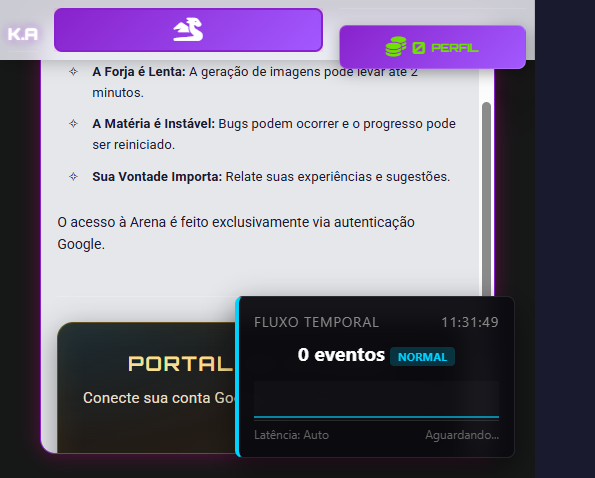
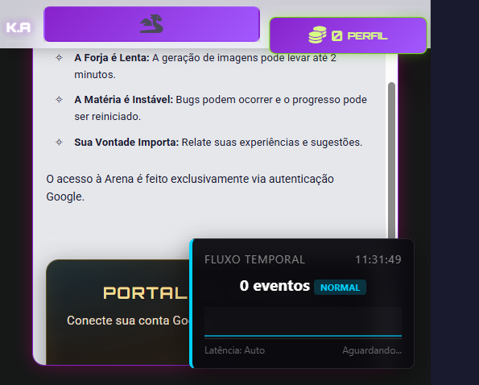
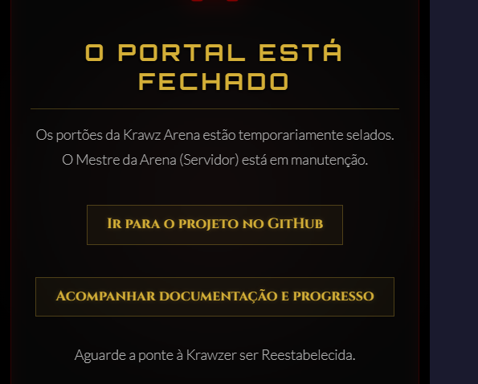
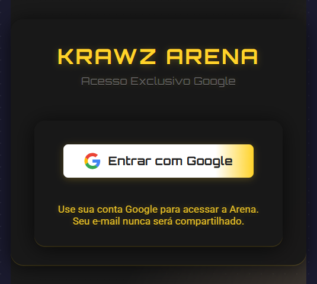

# Krawz Arena Docs

[](#)
[](#)
[](#)
[](#)

Repositório público de documentação do Krawz Arena, um card game/RPG com combate em tempo real, economia in-game e integração com geração de imagem por IA.

Este repositório é focado em apresentação técnica e produto para comunidade, parceiros e patrocinadores. **Atualizado: Maio 2026.**

## O que já está entregue

- Combate em tempo real com WebSocket e **40 habilidades únicas** registradas (incluindo ressurreição, Égide Anímica, Colheita de Almas, Julgamento dos Céus e mais)
- Sistema de habilidades com alta cobertura de testes (64 arquivos de teste cobrindo backend e frontend)
- Progressão de cartas com ciclo da Mão do Jogador no nível 6
- Economia com venda de cartas, depósito PIX, saldo interno e saque PIX com fee
- Programa de afiliados com comissão de 5% sobre saques
- Torneira — sistema de faucet publicitário onde jogadores ganham KK visualizando anúncios
- Chat global via WebSocket com moderação de Game Master
- Cemitério global: qualquer jogador pode ressuscitar (e reclamar a posse de) almas derrotadas
- API REST organizada em rotas e serviços; monitoramento operacional e financeiro embutidos

## Navegação rápida

- [FEATURES.md](FEATURES.md): funcionalidades implementadas e planejadas
- [GAME_MECHANICS.md](GAME_MECHANICS.md): regras centrais do jogo
- [ARCHITECTURE.md](ARCHITECTURE.md): visão de arquitetura
- [API_REFERENCE.md](API_REFERENCE.md): endpoints e exemplos
- [ROADMAP.md](ROADMAP.md): próximos ciclos de entrega
- [SPONSORSHIP.md](SPONSORSHIP.md): modelo de parceria/patrocínio

## Estado técnico atual

- Backend: Node.js + Express + MySQL + ws
- Frontend: Vanilla JavaScript (sem frameworks — performance máxima)
- Testes automatizados: **64 arquivos de teste** cobrindo backend e frontend
- Destaques de cobertura (últimas medições):
    - `PixService.js`: 97.54%
    - `websocket_manager.js`: 86.87%
    - `TorneiraService.js`: alta cobertura via suite dedicada
- Módulos de monitoramento operacional e financeiro em produção (`/api/monitor/`)

## Execução local

```bash
npm install
npm run verify:env
npm run dev:full
```

## Capturas e materiais visuais

A pasta `assets/screenshots/` pode receber capturas de:

- Arena em duelo ao vivo
- Mão do Jogador (nível 6)
- Chat global com moderação
- Fluxo econômico (depósito PIX, venda, saque)
- Torneira com anúncio ativo
- Painel de afiliados

### Galeria atual

As capturas abaixo foram geradas em ambiente local de desenvolvimento.










## Para contribuidores

A fonte canônica de implementação está no repositório principal do código. Este repositório público prioriza conteúdo curado para consumo externo.
